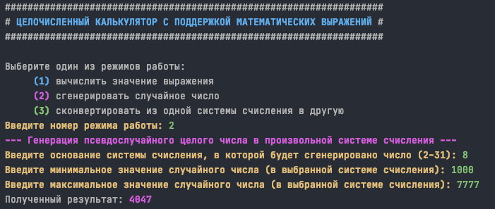

# Калькулятор

- [Компиляция и запуск](#компиляция-и-запуск)
- [Примеры работы](#примеры-работы)
- [Схема работы](#схема-работы)

## Компиляция и запуск

Компиляция:

```shell
cmake .
cmake --build .
```

Запуск:

```shell
./calculator
```

## Примеры работы

Вычисление значения выражения:


Генерация псевдослучайного числа в заданном промежутке:



Конвертация из одной системы счисления в другую:


## Схема работы


## Caution

This project has 0% test coverage and intended for showcase only. It has memory leaks at least :D